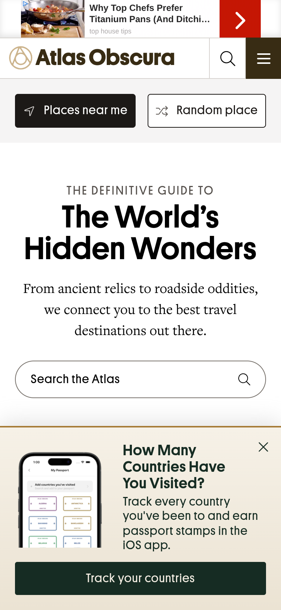
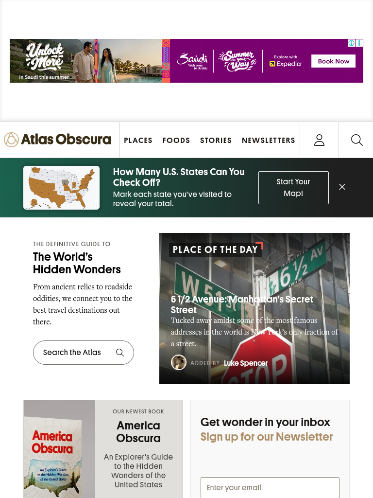
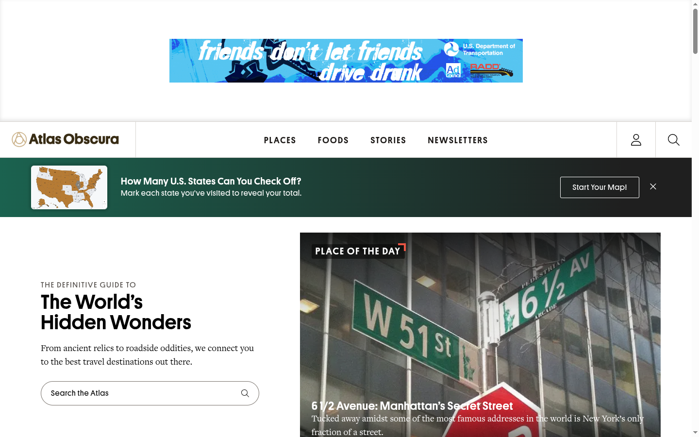

# Технический аудит: Atlas Obscura

Каждое утверждение в отчёте ссылается на файл в [`evidence/`](evidence/), из которого оно получено.
Если признака нет в собранных данных — он не упоминается или помечен как «не обнаружено».
Консольные сниппеты лежат в [`../snippets/`](../snippets/); порядок воспроизведения — в конце отчёта.

## Условия проверки

| Параметр | Значение |
|---|---|
| Дата и время | 2026-09-23, 20:59–21:33 (UTC+3) |
| Браузер | Google Chrome 152.0.7977.82, Linux |
| Сеть | Wi-Fi, дом, 100 Мбит/с |
| DNS в браузере | Secure DNS (DoH): `https://cloudflare-dns.com/dns-query` |
| Профиль | чистый (без cookies, расширений и кэша) |
| Страница | главная, `https://www.atlasobscura.com/`, без прокрутки |
| Баннер согласия на cookies | OneTrust; нажата кнопка **«Allow Cookies»** (`#onetrust-accept-btn-handler`) |

Сайт показывает много рекламы, и за 30 секунд делает сотни запросов. Поэтому сеть записывалась скриптом
[`../record-network.mjs`](../record-network.mjs): он получает те же события Chrome DevTools Protocol, что и вкладка
Network, но без ограничений на число запросов. Запись: 30 с до нажатия «Allow Cookies» и 30 с после.
Сниппеты из консоли выполнялись в отдельной сессии, после нажатия «Allow Cookies».

## 1. Название ресурса

**Atlas Obscura** — заголовок страницы «Curious and Wondrous Travel Destinations - Atlas Obscura».

## 2. Адрес ресурса

<https://www.atlasobscura.com/>

## 3. Архитектура и технологический стек

Источники: [`stack.json`](evidence/stack.json), [`document-headers.txt`](evidence/document-headers.txt),
[`semantic.json`](evidence/semantic.json), [`requests-by-host.txt`](evidence/requests-by-host.txt).
`<meta name="generator">` и `x-powered-by` отсутствуют.

| Слой | Наблюдаемый артефакт | Что он означает (источник) |
|---|---|---|
| CDN / прокси | `server: cloudflare`, `cf-cache-status: DYNAMIC`, `server-timing: cfEdge…, cfOrigin…` | Ответ проходит через Cloudflare |
| Хостинг | `via: 1.1 heroku-router`, `x-request-id`, `nel`/`report-to` с `nel.heroku.com` | Heroku: «`Via`: a code name for the Heroku router» ([Heroku](https://devcenter.heroku.com/articles/http-routing)) |
| Бэкенд | `x-runtime: 0.011312` | Заголовок middleware `Rack::Runtime` — время обработки запроса ([Rails guides](https://guides.rubyonrails.org/configuring.html)) |
| Бэкенд | `x-frame-options: SAMEORIGIN`, `x-xss-protection: 0`, `x-content-type-options: nosniff`, `x-download-options: noopen`, `x-permitted-cross-domain-policies: none`, `referrer-policy: strict-origin-when-cross-origin` | Полностью совпадает со значением по умолчанию `config.action_dispatch.default_headers` в Rails (в документации — набор для Rails ≤ 7.0) ([Rails guides](https://guides.rubyonrails.org/configuring.html)) |
| Бэкенд | `<meta name="csrf-param">`, `<meta name="csrf-token">` | Вывод хелпера Rails `csrf_meta_tags` ([Rails API](https://api.rubyonrails.org/classes/ActionView/Helpers/CsrfHelper.html)) |
| Бэкенд | `id` у `<figure>`: `eyJfcmFpbHMi…--ce8bf6…`; base64 декодируется в `{"_rails":{"data":"gid://atlas/Place/71215?expires_in","pur":"default"}}`, после `--` — 40 hex-символов подписи | Подписанный Global ID Rails: формат `gid://App/Model/id` и вид `<base64>--<подпись>` ([globalid](https://github.com/rails/globalid/blob/main/README.md)). Имя приложения — `atlas`, модели — `Place`, `Article` |
| Фронтенд | глобальные объекты `Turbo` и `Stimulus`; атрибуты `data-turbo*`, `data-controller` | Hotwire: [Turbo](https://turbo.hotwired.dev/reference/drive) и Stimulus (`window.Stimulus = application` — шаблон [stimulus-rails](https://github.com/hotwired/stimulus-rails/blob/main/lib/install/app/javascript/controllers/application.js)) |
| Сборка | стили `/vite/assets/aon.tailwind-26057ac9.css`, `/vite/assets/aon-cc246122.css` | Путь `/vite/assets/` — значение по умолчанию Vite Ruby (`publicOutputDir: "vite"`) ([Vite Ruby](https://vite-ruby.netlify.app/config/)) |
| CSS | имя файла `aon.tailwind-…css`; классы вида `md:flex`, `z-[9999]`, `lg:col-span-4`; точки перелома 640/768/1024/1280/1536 px | [Tailwind CSS](https://tailwindcss.com/docs/responsive-design) (стандартные breakpoints `sm`–`2xl`) |
| Прочее | класс `stimulus-reflex-disconnected` у `<body>`; класс `splide__slide` у слайдов | Присутствуют; интерпретация не даётся (прямой документации класса не найдено) |

Не обнаружено: React, Vue, Angular, Next.js, Nuxt, jQuery, WordPress ([`stack.json`](evidence/stack.json)).

**Логика работы.** По совокупности маркеров выше — серверный рендеринг на Ruby on Rails (Heroku за Cloudflare, `x-runtime` — 11 мс);
на клиенте подключены Turbo и Stimulus (Hotwire). Статика — с поддоменов `assets.`, `img.`, `images.`,
`fonts.atlasobscura.com`.

**Объём запросов** ([`requests-by-host.txt`](evidence/requests-by-host.txt)): за 60 с — **454 запроса к 150 хостам**,
из них 449 — до нажатия «Allow Cookies». Со своих доменов (`*.atlasobscura.com`) — 54 запроса, остальное — сторонние.
По типам: Script 140, Image 135, Fetch 91, XHR 34, Document 17 (iframes), Ping 12, Font 9, Stylesheet 5.

**Заголовки безопасности** ([headers](evidence/document-headers.txt)): см. строку «Бэкенд» выше; `strict-transport-security: max-age=300`;
CSP только в режиме `content-security-policy-report-only` (от Cloudflare), то есть ничего не блокирует.

## 4. Семантические элементы HTML5

Источник: [`semantic.json`](evidence/semantic.json). Всего `
` на странице — 674.

| Элемент | Кол-во | Для чего используется (по классу / aria-label / первому заголовку) |
|---|---|---|
| `<header>` | 37 | Шапки карточек и блоков: заголовки разделов («Begin Your Journey», «Explore the Atlas»), `header.header` в карточках городов (Madrid, Warsaw, Barcelona, Tokyo), шапки статей |
| `<nav>` | 1 | `nav#navbar-component` — главная навигация сайта |
| `<main>` | 1 | Основной контент страницы |
| `<article>` | 45 | Карточки контента: `aon--card-destination-component` (направления), `homepage--hero--main-story` (главная статья), `aon--simple-card`, `aon--card--main-card-component` (места в карусели) |
| `<section>` | 38 | Блоки главной (hero, «Popular Destinations», рассылка `#homepage-newsletter-component`, поиск), списки «Countries» / «Cities» (`aria-label`), рекламные слоты (`advertisement-shadow`, `advertisement-disclaimer`) |
| `<footer>` | 45 | Подвалы карточек и статей: все 45 вложены в контейнеры контента (`div.content`, `article.homepage--hero--main-story`, `div.body` и др.), а не в `<body>` |
| `<figure>` / `<figcaption>` | 13 / 13 | Изображения мест и статей с подписями |
| `<time>` | 4 | Даты |
| `<picture>` | 64 | Изображения внутри ссылок-карточек (`a.group`) |
| `aside`, `address`, `mark`, `details`, `summary`, `dialog`, `search`, `hgroup` | 0 | — |

## 5. Семантические классы при вёрстке `
`

Источник: [`div-classes.json`](evidence/div-classes.json). Из 674 `
` класс есть у 592, различных классов — 464.

Большинство самых частых классов — **утилиты Tailwind** (не семантические): `flex` (98), `relative` (48), `w-full` (46),
`absolute` (46), `items-center` (40). Семантические классы (именованные компоненты) тоже есть; назначение ниже — по названию класса:

- `aon--avatar-group-component` (17), `aon--byline-avatar-component` (16) — группа аватаров, аватар автора;
- `activity-streams--button` (32), `lists-popup--anchor` (16) — кнопка ленты активности, якорь всплывающего списка;
- `articles--carousel-grid--image` (14) — изображение в сетке-карусели статей;
- `statistic-box` (14) — блок статистики;
- `aon-heading-tiniest` (22), `aon-label-smaller` (18), `aon-container-fluid` (13) — заголовок, подпись, контейнер.

Подход смешанный: утилитарная вёрстка Tailwind плюс именованные компоненты в стиле БЭМ (`блок--элемент`).

## 6. Адаптивность

Источники: [`media.json`](evidence/media.json) (правила, доступные из JS), [`media-css.txt`](evidence/media-css.txt)
(основные таблицы стилей — из тела ответа, потому что с другого домена JS их прочитать не может), скриншоты в [`evidence/screenshots/`](evidence/screenshots/).

- `<meta name="viewport" content="width=device-width, initial-scale=1.0">` присутствует.
- Основной CSS `aon.tailwind-26057ac9.css` содержит **201 блок `@media`**, почти все — `min-width`:
  768 px (50), 1024 px (43), 1536 px (29), 1280 px (24), 640 px (17), 960 px (12) — подход **mobile-first**,
  стандартные точки перелома Tailwind `sm`/`md`/`lg`/`xl`/`2xl`.
- Также: `prefers-reduced-motion` (6), `print` (1), `-ms-high-contrast` (2).
- Встроенные `<style>` — ещё 14 различных запросов, в т.ч. `(max-width: 530px)`,
  `(max-width: 896px) and (max-height: 425px) and (orientation: landscape)`.

| 375 px | 768 px | 1440 px |
|---|---|---|
|  |  |  |
| меню-«гамбургер», кнопки «Places near me» / «Random place», hero в одну колонку | полное меню, две колонки | полное меню, hero в две колонки |

## 7. Lighthouse

Lighthouse 13.5.0 (CLI), по 3 прогона на каждый режим, в таблице — медиана по каждому столбцу.
Команда: [`../run-lighthouse.sh`](../run-lighthouse.sh) `atlasobscura https://www.atlasobscura.com/`;
сводка: `node ../summarize-lighthouse.mjs atlasobscura` (скрипт отбрасывает прогон, если главный документ ответил не 200 —
защита от страницы блокировки Cloudflare). Полные отчёты — [`evidence/lighthouse/`](evidence/lighthouse/).
Режимы эмуляции те же, что у Historypin: mobile — moto g power (2022), RTT 150 мс, 1,6 Мбит/с, CPU ×4; desktop — RTT 40 мс, 10 Мбит/с.
Lighthouse не нажимает «Allow Cookies» — это проверка первого визита без согласия.

| Прогон | Performance | Accessibility | Best Practices | SEO | FCP, s | LCP, s | TBT, ms | CLS | SI, s |
|---|---|---|---|---|---|---|---|---|---|
| mobile-1 | 28 | 85 | 54 | 83 | 4.0 | 8.4 | 29248 | 0.030 | 33.8 |
| mobile-2 | 28 | 85 | 54 | 83 | 4.0 | 8.4 | 14367 | 0.039 | 31.8 |
| mobile-3 | 28 | 85 | 54 | 83 | 4.0 | 8.4 | 42725 | 0.030 | 32.4 |
| **Mobile, медиана** | **28** | **85** | **54** | **83** | **4.0** | **8.4** | **29248** | **0.030** | **32.4** |
| desktop-1 | 29 | 85 | 54 | 83 | 2.9 | 4.2 | 1894 | 0.060 | 8.3 |
| desktop-2 | 35 | 85 | 54 | 83 | 2.2 | 2.9 | 2899 | 0.084 | 9.3 |
| desktop-3 | 36 | 85 | 54 | 83 | 2.1 | 2.8 | 1743 | 0.064 | 8.1 |
| **Desktop, медиана** | **35** | **85** | **54** | **83** | **2.2** | **2.9** | **1894** | **0.064** | **8.3** |

**Стабильность прогонов.** В 4 из 6 отчётов Lighthouse предупреждает: «The page loaded too slowly to finish within
the time limit. Results may be incomplete.» (`runWarnings`). Три попытки завершились ошибкой и были повторены скриптом
(«Session with given id not found» ×2, «the page stopped responding» ×1). Вес страницы — 10–11 МБ во всех прогонах,
кроме desktop-1 (56 192 КиБ).

**Основные замечания** (mobile-3 / desktop-1):
- **Performance (28 / 35):** Total Blocking Time — 42,7 с на mobile и 1,9 с на desktop; время выполнения JS (`bootup-time`) — 84,7 с / 11,0 с;
  работа главного потока — 110,0 с / 16,9 с; за время проверки — 4 721 запрос (mobile).
- **Accessibility (85):** проваленные аудиты: `color-contrast` (недостаточный контраст), `image-alt` (нет `alt` у изображений),
  `link-name` (ссылки без текста), `aria-hidden-focus` (фокусируемые элементы внутри `aria-hidden`), `target-size` (мелкие области нажатия).
- **Best Practices (54):** `third-party-cookies` — 499 сторонних cookies (mobile), `deprecations` — 6 устаревших API,
  `errors-in-console` — ошибки в консоли, `inspector-issues` — проблемы в панели Issues.
- **SEO (83):** `link-text` — 3 ссылки с неописательным текстом, `image-alt`.

## 8. Локальное хранилище и cookies

Источники: [`storage.json`](evidence/storage.json) (localStorage / sessionStorage из JS),
[`cookies.txt`](evidence/cookies.txt) (все cookies браузера, включая HttpOnly и сторонние).

- **localStorage:** 94 ключа. Среди них: PostHog (`ph_phc_…_posthog`), Klaviyo (`klaviyoOnsite`, `__kl_key`),
  рекламные идентификаторы (`id5id_v2_…`, `33acrossId`, `_pubcid`, `cto_bundle`, `_GESPSK-*` — ключи для
  criteo.com, liveramp.com, uidapi.com, id5-sync.com и др.), `_grecaptcha`, `NRBA_SESSION::…` (New Relic).
- **sessionStorage:** 23 ключа, в т.ч. `tt_sessionId`, `tt_pixel_session_index` (TikTok), `klaviyoPagesVisitCountV2`, `is_eu`.
- **Cookies:** всего **172**; от своего домена — 38, сторонних — 134 от **68 доменов**; HttpOnly — 39; Partitioned — 15.
  - свои (примеры): `_session_production` (HttpOnly), `user_signed_in`, `OptanonConsent` / `OptanonAlertBoxClosed` (OneTrust),
    `cf_clearance` (Cloudflare), `_ga`, `_ga_M3FGM78D1R`, `_ga_VE390YR3HM` (Google Analytics), `_hjSession_1038905` (Hotjar),
    `_clck` / `_clsk` (Clarity), `_ttp` (TikTok), `_pin_unauth` (Pinterest), `__qca` (Quantcast), `__gads` (Google Ads);
  - сторонние — в основном рекламные биржи и синхронизация идентификаторов (rubiconproject.com, pubmatic.com, doubleclick.net,
    adnxs.com, casalemedia.com, criteo.com, tapad.com, adsrvr.org, linkedin.com, bing.com и др.), полный список — в [`cookies.txt`](evidence/cookies.txt).

## 9. Маркетинговые инструменты и аналитика

Источники: [`network-log.json`](evidence/network-log.json), [`trackers.txt`](evidence/trackers.txt).
Фильтр по ключевым словам задания (подстрока в URL, 454 запроса):

| Ключевое слово | Запросов (до согласия) | Хосты |
|---|---|---|
| `analytics` | 22 (21) | analytics.google.com ×6, analytics.tiktok.com ×8, analytics-ipv6.tiktokw.us, static-tracking.klaviyo.com, hb-analytics.nextmillmedia.com, b-s.tercept.com ×2, tag.yieldoptimizer.com, cdn.keywee.co, cdn.ampproject.org |
| `metrika` | 0 | не обнаружено |
| `facebook` | 3 (3) | connect.facebook.net ×2, www.facebook.com |
| `pixel` | 35 (35) | cm.g.doubleclick.net ×11, analytics.tiktok.com ×8, pixel.quantserve.com ×6, pixel.adsafeprotected.com ×3, pixel.quantcount.com ×2, exch./pixel-ssn.quantcount.com, pixel.rubiconproject.com, pixels.ad.gt, protected-by.clarium.io |
| `tagmanager` | 9 (9) | www.googletagmanager.com ×7, www.google.com ×2 |
| `hotjar` | 3 (3) | static.hotjar.com, script.hotjar.com ×2 |

Инструменты, опознанные по URL и идентификатору ([`trackers.txt`](evidence/trackers.txt)):

| Инструмент | Доказательство в запросах |
|---|---|
| Google Tag Manager | `gtm.js?id=GTM-KXJCD57`, `gtm.js?id=GTM-PH5RC2F` |
| Google Analytics 4 | `gtag/js?id=G-VE390YR3HM`, `G-M3FGM78D1R`, `G-FVWZ0RM4DH`; `g/collect?…tid=G-…` |
| Meta (Facebook) Pixel | `connect.facebook.net/en_US/fbevents.js`, `facebook.com/tr/?id=1651185805144770` |
| Hotjar | `static.hotjar.com/c/hotjar-1038905.js` |
| TikTok Pixel | `analytics.tiktok.com/i18n/pixel/events.js?sdkid=CUUUR7JC77UF169S8CUG` |
| Microsoft Clarity | `clarity.ms/tag/lf5vdfyz6d` |
| Pinterest Tag | `s.pinimg.com/ct/core.js`, `ct.pinterest.com/v3/` |
| PostHog | через свой поддомен `t.atlasobscura.com/array/phc_…/config.js`, `…/posthog-recorder.js` (запись сессий) |
| Plausible | `plausible.io/js/plausible.js` |
| Cloudflare Web Analytics | `static.cloudflareinsights.com/beacon.min.js` |
| comScore | `sb.scorecardresearch.com/…/beacon.js` |
| Quantcast | `secure.quantserve.com/quant.js` |
| Klaviyo | `static.klaviyo.com/onsite/js/UUnqkC/klaviyo.js` |
| New Relic Browser | `js-agent.newrelic.com/nr-spa-1.322.0.min.js`, `bam.nr-data.net` |
| OneTrust (баннер согласия) | `cdn.cookielaw.org/…/otSDKStub.js`, `…/OtAutoBlock.js` |

Кроме аналитики — рекламный стек: Google Ad Manager / AdSense (`securepubads.g.doubleclick.net`, `pagead2.googlesyndication.com`),
Criteo (`static.criteo.net`, `gum.criteo.com`) и десятки бирж синхронизации cookie (см. [`requests-by-host.txt`](evidence/requests-by-host.txt)).

**Согласие на cookies.** Все инструменты из таблицы выше загрузились **до** нажатия «Allow Cookies»
(колонка `b` в [`trackers.txt`](evidence/trackers.txt)), хотя на странице подключён `OtAutoBlock.js` OneTrust.
После нажатия за 30 с было только 5 новых запросов.

---

## Как воспроизвести

1. Chrome → Настройки → Конфиденциальность и безопасность → Безопасность → **Использовать безопасный DNS** → Cloudflare (1.1.1.1).
2. Открыть чистый профиль: `google-chrome --user-data-dir="$(mktemp -d)" --no-first-run`.
3. F12 → **Network**: включить *Preserve log* и *Disable cache*; открыть `https://www.atlasobscura.com/`;
   подождать 30 с; нажать **«Allow Cookies»**; подождать ещё 30 с.
4. **Network** — фильтр по словам из п. 9 и по доменам из [`trackers.txt`](evidence/trackers.txt);
   запрос документа → *Headers* — сверить с [`document-headers.txt`](evidence/document-headers.txt);
   CSS `aon.tailwind-…css` → *Response*, Ctrl+F `@media` — сверить с [`media-css.txt`](evidence/media-css.txt).
   Автоматически то же самое записывает `node ../record-network.mjs atlasobscura https://www.atlasobscura.com/ '#onetrust-accept-btn-handler' 30`.
5. **Console**: при первой вставке набрать `allow pasting`; вставить по очереди файлы из [`../snippets/`](../snippets/)
   и сравнить с одноимёнными `.json` в `evidence/`.
6. **Application → Cookies / Local storage / Session storage** — сверить с п. 8.
7. Адаптивность: **Device Toolbar** (Ctrl+Shift+M), ширина 375 / 768 / 1440.
   Важно: при повторных загрузках в той же сессии Cloudflare может показать страницу «Sorry, you have been blocked» —
   тогда открыть новый чистый профиль.
8. Lighthouse: `cd docs/reports/lighthouse && ./run-lighthouse.sh atlasobscura https://www.atlasobscura.com/`,
   затем `node summarize-lighthouse.mjs atlasobscura`.

Числа (запросы, cookies, рекламные домены) будут отличаться от прогона к прогону: набор рекламы разный при каждой загрузке.
